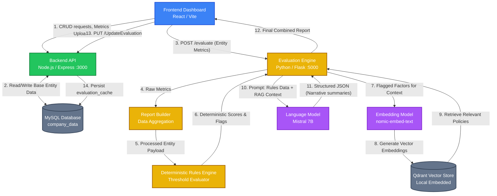

# Credit Risk Analysis Project Report

## 1. System Architecture Overview

### 1.1 Introduction
The Credit Risk Analysis system is designed to provide comprehensive, scalable, and highly accurate evaluations of corporate entities by combining deterministic financial rule engines with advanced Large Language Model (LLM) capabilities via Retrieval-Augmented Generation (RAG). The architecture adopts a decoupled, microservices-oriented approach where the frontend dashboard, Node.js backend server, Python-based evaluation API, and database layers operate semi-independently. This modularity ensures that heavy computational tasks—such as generating analytical narratives through Ollama models and Qdrant vector retrieval—do not block core CRUD (Create, Read, Update, Delete) operations necessary for the frontend application to function securely and efficiently.

### 1.2 Overall Workflow of the System
The workflow of the system follows a clear pipeline starting from data ingestion down to analytical dashboard presentation:

1. **Entity Data Consolidation**: 
   The system starts at the data layer where financial parameters, categorical metadata (such as country and sector), and historical behaviors are aggregated. A comprehensive MySQL database schema (`company_data.entities_final_1`) acts as the single source of truth, storing base entity parameters, scalar evaluation scores, and an overarching JSON payload containing custom metrics (`metrics_json`).
   
2. **Initial API Handshake & Routing**: 
   The React-based frontend dashboard calls the Node.js backend (port 3000) for standard operations. If the user requests an advanced credit assessment or wants to regenerate risk factors, the React client initiates a `POST` request to the specialized Python evaluation service (port 5000). To ensure data completeness, the Node.js API pre-merges SQL and CSV-injected variables from `metrics_json` to formulate a consolidated client request payload.

3. **Deterministic Processing and Rules Engine Verification**: 
   Once the payload hits the Python layer, an initial processing script (`report_builder.py`) filters and types the incoming metrics. A static, deterministic rules engine evaluates these metrics against predefined thresholds (loaded from `factor_thresholds_evaluator_global-truth.csv`). Numerical benchmarks such as Debt-to-Equity, Current Ratios, and Profit Margins trigger specific qualitative buckets (e.g., Low, Medium, High risk) ensuring a highly reliable baseline before any AI generation takes place.

4. **Context Retrieval through RAG (Retrieval-Augmented Generation)**: 
   To provide contextual explanations that a static rules engine cannot articulate naturally, the system uses a local vector store (Qdrant) embedded with `nomic-embed-text` embeddings. When a specific factor is flagged (e.g., High Sanctions Exposure), the system runs a fast query against Qdrant to retrieve internal guidelines, compliance definitions, or analogous risk profiles. In "Agentic" mode, the RAG implements a secondary retrieval pass targeting high-risk flags and deduplicates chunks to maximize prompt efficiency.

5. **LLM Generation**: 
   Context from the RAG subsystem, together with the deterministic numeric outputs and flags, is injected into a specialized prompt and sent to an Ollama-hosted LLM (typically `mistral`). The LLM is restricted to generating output in a predefined structured format (like an executive summary panel, country risk narrative, and portfolio vulnerability). The LLM processes the risk factors mathematically verified by the rules engine and structures it into human-readable memorandums without hallucinating the foundational numbers.

6. **State Caching and Dashboard Rendering**: 
   The parsed LLM summary and the composite deterministic scores are returned to the frontend. Simultaneously, the frontend instructs the backend (`PUT /UpdateEvaluation`) to cache this heavy calculation payload (`evaluation_cache`) inside the MySQL database. Consequently, subsequent loads of this entity’s data on the dashboard are instantaneous and bypass the token-heavy LLM loop.

### 1.3 Component Interaction (API → Processing → Rules → ML → RAG → LLM → Dashboard)

The interactions between the technical stack components facilitate a unidirectional data transformation pipe:
- **API (Node.js & Express)**: Acts as the gateway. It manages Authentication, generic metric uploads, and database writes. All interactions requiring persistence or reading state go through here.
- **Processing (Python Flask Setup)**: Accepts the merged entity JSON. Ensures all necessary fields conform to types expected by the downstream processes, resolving any conflicts between database legacy fields and new override requests.
- **Rules (Deterministic Engine)**: Evaluates the processed variables strictly against the threshold benchmarks. This component is the "ground truth"—it generates the composite sub-scores and numerical gauges that are immune to LLM hallucination.
- **ML / Embedding Setup**: Handles text tokenization and creates dense vector permutations. Text representations of the deterministic failures are passed through the embedding model to locate similar semantic policies.
- **RAG (Qdrant Vector DB)**: The vector database searches and returns textual guidelines relevant to the entity's precise risk triggers ensuring the subsequent LLM generation is well-grounded in institutional knowledge.
- **LLM (Ollama - Mistral)**: The reasoning engine. It merges the rigid output from the Rules engine and the contextual policies from the RAG store to formulate dynamic, readable executive summaries and sub-reports. It formats this data primarily as JSON for easy downstream deserialization.
- **Dashboard (React.js/Vite)**: Parses the complex JSON object. It splits numeric gauge data into visual donut/bar charts and populates advanced text summaries into a memorandum-style "Advanced Report" page.

### 1.4 Architecture Diagram



### 1.5 Architecture Diagram Explanation

The diagram illustrates the asynchronous and multi-tiered nature of the project. Here is an in-depth explanation of the data lifecycle depicted in the mermaid chart:

- **The Presentation Layer (UI)**: The process originates at the React-based frontend. It communicates with the intermediate backend (`Node.js/Express`) for all standard CRUD operations, like adding entities, updating details, and fetching lists for the main table.
- **The Persistence Layer (NodeAPI & MySQL)**: The Node backend acts exclusively as a data broker connecting to MySQL. It reads the `company_data` table and surfaces the `metrics_json` to the frontend. Once evaluations are complete, the frontend securely routes the complex resulting data blob back to the Node API, which acts as a reliable storage hook to update the `evaluation_cache` column in the database.
- **The Core Calculation Layer (Python API)**: When a real-time evaluation is requested, the frontend talks directly to the Python API (running on port `5000`). This directs the workload appropriately:
  - First, the **Report Builder** sanitizes the hybrid SQL/CSV metrics.
  - Second, the **Rules Engine** generates immutable scores (e.g., determining exactly that a parameter gives a 'Medium' risk) based on standard CSV guidelines.
- **The RAG Layer**: The text elements for rules triggered by the Rules Engine are passed to an embedding sub-network (`nomic-embed-text` locally served via Ollama). These vectors query an embedded Qdrant database to pull organizational intelligence regarding those specific risks.
- **The Intelligence Layer (Ollama/Mistral)**: A massive prompt concatenating numerical realities (from the Rules Engine) and operational wisdom (from the Qdrant retrieval) is compiled. This guarantees the LLM (`Mistral`) operates under tight guardrails. The LLM converts this complex matrix into a readable format, exporting structural JSON.
- **The Loop Closure**: The Python API returns this JSON alongside the uncorrupted deterministic gauges directly to the React application, which simultaneously renders the UI and triggers a caching callback to the Node layer, meaning a heavy evaluation only runs once unless manually triggered again. This prevents recursive wait times and server overloading.

## 2. Dataset Handling & Preparation

### 2.1 Database Schema and Storage Foundation
The foundational storage for the project relies on a structured relational model implemented in MySQL (`company_data` database). The primary table, `entities_final_1`, is explicitly designed to handle a dual-nature data ingestion model: rigid scalar fields and flexible JSON documents.

- **Identity & Scalar Fields**: Core attributes are fixed at the schema level. These include identifiers (`entity_id`, `entity_name`), categorical metadata (`sector`, `country`), and numerous strict financial metrics (e.g., `revenue_usd_m`, `ebitda_margin_pct`, `debt_to_equity`, `interest_coverage`, `current_ratio`). 
- **Investment & Risk Flags**: Distinct investment-related metrics (Probability of Default `PD_1y_pct`, Loss Given Default `LGD_pct`, Exposure at Default `EAD_usd_m`) and systemic risk flags (`governance_score_0_100`, `sanctions_exposure`, `payment_incidents_12m`) are maintained as native columns to allow simple querying and deterministic logic targeting.
- **Dynamic JSON Repositories (`metrics_json` & `evaluation_cache`)**: To bridge the gap between static dataset entities and dynamic real-world credit analysis, the system introduces `metrics_json`. This `LONGTEXT` column allows users to inject unstructured or highly customized financial CSV factors on the fly without DB migrations. Similarly, `evaluation_cache` stores the heavy output of LLM/RAG generation.

### 2.2 Data Source Hierarchies and Baseline Data
The data ingested into the system comes through a rigorous hierarchy, resolving conflicts based on the source's priority:

1. **The Static 50-Entity Base dataset**: A core foundational CSV (`credit_risk_dataset_50_entities.csv`) exists in the ecosystem. This file provides realistic mock data for 50 initial corporate entities covering various sectors and risk profiles. For a newly deployed environment, this is commonly bootstrapped into the system to allow immediate dashboard interactions.
2. **Dynamic Overrides via `metrics_json`**: If an `entity_id` is present in the base dataset, any incoming payload via the API overrides those base fields. This dynamic patching allows for real-time adjustments (e.g., updating a company's debt-to-equity ratio via the dashboard) without altering the foundational mock datasets.
3. **Stand-Alone Entities**: If an `entity_id` is genuinely new and does not exist in the base dataset, the system shifts strictly to the user-supplied data (submitted via the frontend modal or bulk CSV upload), mandating that all primary scalar fields are populated dynamically to ensure the evaluation engine has data to process.

### 2.3 The Single Dataset Evaluator: Rules & Thresholds
A critical component of the data preparation is the `factor_thresholds_evaluator_global-truth.csv`. This dataset isn't standard relational data; it is the "DNA" of the rules engine.
- Every financial data point from the entity dataset (e.g., `dscr` - Debt Service Coverage Ratio) correlates directly to a row in the thresholds dataset.
- The threshold dataset defines structural limits (e.g., if DSCR < 1.0 = High Risk; if DSCR > 1.5 = Low Risk). 
- In the data preparation phase, the Python Processing API aligns the numeric values of the incoming entity dataset explicitly against the rules in this CSV to automatically infer deterministic risk parameters before any AI interaction.

### 2.4 Data Ingestion and Handling Mechanisms

The project features multiple ingestion methods to populate and prepare data for the evaluation matrix:
- **Interactive UI Modification**: The platform features an "Add New Entity" form. It passes identity details to Node.js which inserts them into the `entities_final_1` table via standard SQL parameters. To maintain absolute sync, a UI submission automatically triggers a generic `GetAll` refetch.
- **Single Entity CSV Upload**: The system accepts a structured `.csv` (`entity_metrics_template.csv`) upload for an individual company. The dataset is parsed and routed through `PUT /entityMetrics`. Instead of altering table structures, the data is instantly merged and stored into the stringified `metrics_json` column. 
- **Bulk CSV Import (`POST /bulkImport`)**: Essential for corporate onboarding phases. The system uses an `INSERT ... ON DUPLICATE KEY UPDATE` methodology. It safely extracts the five core identity parameters to guarantee row creation. Any remaining columns—from standard P&L financial data to categorical factors—are forcefully parsed and saved into matching scalar db columns AND bundled into the dynamic `metrics_json`.

### 2.5 Multi-Tiered Dataset Subsets
The project's internal `Dataset/` structure suggests progressive complexity mapping to user needs:
- `Basic-NextGenCreditRiskEvaluator`: Contains simple tabular datasets designed likely for primary heuristic development or testing raw database ingestion without the overhead of AI metrics.
- `Intermediate-Credit-Risk-UseCase-DataSet`: Includes standard LLM inputs where simple data tables are evaluated against a less rigid LLM rule base.
- `Advanced-Credit-Risk-UseCase-RAG-DataSet`: Involves comprehensive vector databases, narrative guidelines, compliance definitions, and complex memo datasets designed to be indexed into the Qdrant core for robust contextual generation.

### 2.6 Normalization and Sanitization
Before data reaches the Python evaluation engine or is visualized on the React dashboard, meticulous sanitization occurs:
- `normalizeEntityId`: Data is sanitized on ingestion to ensure `entity_id` values do not contain `#` prefixes which are sometimes introduced by external systems or mock CSVs.
- **Handling Null Scalars**: Due to the flexibility of `metrics_json`, primary scalar columns in the database may occasionally read `NULL`. The backend data wrapper aggregates and synthesizes both the DB scalar values and the JSON blob into a flat JavaScript object so the dashboard frontend is never exposed to null references, resulting in a cohesive, pre-processed analytical feed.

## 3. Data Preprocessing

Data preprocessing within the system occurs synchronously across both the Node.js backend and the Python evaluation engine. Due to the hybrid nature of the architecture—merging structured SQL scalars, unstructured JSON blobs, and static CSV definitions—a multi-layered preprocessing pipeline is required.

### 3.1 Backend Preprocessing: Payload Construction & Normalization

Before data is served to the frontend or sent to the evaluation engine, the Node.js API (`controller.js`) ensures structural conformity.

1. **Identifier Sanitization (`normalizeEntityId`)**:
   Identifiers ingested via CSVs or older external integrations occasionally prepend a `#` symbol to entity codes (e.g., `#ENT01`). The backend preprocesses every single payload request natively, using substring trimming to enforce a universally normalized syntax (`ENT01`). This ensures that database lookups (`entityIdVariants`) safely retrieve metrics regardless of frontend typo inconsistencies or legacy formatting.

2. **Nested Object Flattening (`GetEntities()`)**:
   When the React dashboard fetches data, it expects a uniform object. The MySQL schema, however, strictly separates `entity_name` and scalar financials from user-injected bulk data housed in `metrics_json`. The Node API intercepts the SQL response, gracefully parses the stringified `metrics_json` object (defaulting to empty arrays catching corrupted strings), and flattens the properties dynamically directly onto the root object. This preprocessing allows the React grid to read `covenant_quality` without needing to know if it came from the core SQL scalar or was a user-injected override.

3. **Defensive Structural Parsing (`sqlPartsForMetricsUpdate()`)**:
   During data ingestion (bulk upload or manual addition), the backend iterates linearly over incoming objects to construct `UPDATE` queries. Crucially, it validates keys against `METRIC_DB_COLUMNS`. It preprocesses the payload by stripping completely blank fields (`""`) or explicit `null` definitions prior to generating the SQL. This guarantees that a partial CSV upload does not inadvertently obliterate previously recorded parameters in the MySQL layer.

### 3.2 Python API: Type Casting and Numerical Stability

When the evaluated payload eventually hits the Python service (port 5000), it bridges the gap between raw web JSON and deterministic financial logic via `report_builder.py`.

1. **Strict Type Coercion (`_num()`)**:
   Because the dataset is a hybrid of CSV data (everything is a string) and SQL inputs (combinations of floats and strings), the system avoids `TypeError` vulnerabilities through a uniform wrapper function, `_num()`. This function intercepts variables, strips blanks, safely executes float conversions, and handles `ValueError` exceptions natively. Crucially, it supports parameterized fallbacks—for instance, if `dscr` (Debt Service Coverage Ratio) drops entirely from a corrupt payload, `_num()` defaults it safely so the logic does not crash.

2. **Categorical Normalization**:
   String-based columns require alignment before mathematical or AI interpretation. Categoricals like `industry_cyclicality` (e.g., parsing "High", "highly cyclical", or "HIGH") are funneled through `.lower()` string modifiers. This preprocessing ensures that textual anomalies don't bypass the deterministic rules engine during scoring.

3. **Factor Header Reconstruction**:
   The `factor_thresholds_evaluator_global-truth.csv` utilizes highly descriptive, encoded headers containing explicit threshold mappings (e.g., `auditor_tier (Other=0, Big4=1)`). During the rule evaluation phase, the Python API mathematically truncates and splits these strings at parenthesis markers (`.split("(")[0].strip()`) to programmatically align them against the standard, unencumbered keys arriving from the payload.

### 3.3 Rule Engine Alignment and Data Merging

The dataset relies heavily on the `credit_risk_dataset_50_entities.csv` static baseline. The data preprocessing mechanism natively constructs a cascading hierarchy for evaluation overrides:

- The script first loads the static CSV as the structural base definition for the chosen ID.
- Second, it performs a real-time dict extraction against the dynamically merged JSON payload arriving from the POST request. 
- Using standard unpacking dictionary combinations (`{**base, **llm_overrides}`), any user-defined numeric adjustment seamlessly overrides the default parameters without requiring complex delta tracking. This preprocessed composite dictionary acts as the absolute ultimate truth object for both the RAG LLM engine and the composite score calculation.

### 3.4 Outlier Capping and Algorithmic Guardrails

During preprocessing of specific risk elements like `_portfolio_block()`, the logic imposes strict mathematical constraints designed to cap outliers caused by erroneous manual entry:
- An uploaded probability of default (`PD_1y_pct`) could theoretically be artificially inflated by user error.
- The `_portfolio_block` applies `min()` bounding functions natively (e.g., capping max concentration mathematically to `85.0%` regardless of upstream anomaly generation).
- This level of bounded preprocessing ensures that downstream visualizations (donut gauges and charts) remain structurally intact relative to the UI limits even if extreme outliers are introduced.

## 4. Module Description

The project is structurally divided into distinct architectural components, facilitating individual maintenance, testing, and independent scaling. 

### 4.1 System Modules Quick Reference

| Module Category | Path/Location | Core Responsibility | Primary Technologies |
| :--- | :--- | :--- | :--- |
| **Presentation Tier** | `frontend_intermediate/` | User Interface, routing, rendering interactive data tables/graphs. | React.js, Vite, CSS |
| **Logic & UI Router** | `frontend_intermediate/src/dashboard/` | Splitting Dashboard logic (FrontPage) from narrative generation (AdvancedDash). | React Hooks, Context |
| **Gateway & Data API** | `backend_intermediate/` | Resolving frontend requests to database persistence layers safely. | Node.js, Express, SQL |
| **Core Database** | `database/` | Relational storage for entity base logic & AI text caching. | MySQL |
| **Evaluation Engine** | `llm_intermediate/llm.py` | Routing Python traffic, orchestrating rule calculations vs model generation. | Python, Flask, REST |
| **Deterministic Builder** | `llm_intermediate/report_builder.py`| Typecasting inputs, processing rule-based math, applying structural caps. | Python |
| **Semantic Intelligence** | `llm_intermediate/rag.py` | Embedding failed vectors, fetching contextual organizational policies. | Qdrant, Ollama, Python |

### 4.2 Frontend Web Module (React + Vite)
Located under `frontend_intermediate/`, this repository forms the Graphical User Interface (GUI), providing administrators and risk analysts an interactive environment to process portfolio data.

- **`FrontPage.jsx`**: Acts as the primary operational hub. Functions include mapping the extensive JSON array retrieved from the Node API into a sortable data grid, presenting high-level risk composite scores (typically via dynamic Gauge or Donut charts mapping `0-100` scores), and handling user forms for "Add Entity" and "Bulk Import".
- **`AdvancedDashboard.jsx`**: A specialized visualization component mapped to `/advanced`. Instead of simple numbers, this component consumes complex nested JSON objects (e.g., `financial_capacity`, `country_risk`, `portfolio_analysis`) and maps them into a "Memorandum" reporting style. It renders the long-form Executive Summaries created by the LLM.
- **Authentication (`authProvider.jsx` / `AdminLogin.jsx`)**: Enforces simulated or real access constraints. Wrapped via standard React Context, it ensures the entire dashboard tree is completely obscured behind a login gateway styled with a dark, blurred gradient.

### 4.3 Backend Intermediary (Node.js API)
Located inside `backend_intermediate/`, this Node server (Port `3000`) decouples the presentation layer from the MySQL database server.

- **`index.js`**: The bootstrap gateway that binds routes and initializes the Express JSON parsers. It establishes the persistent MySQL connection pool passed implicitly to controllers. 
- **`controller.js`**: Houses the strict data handling logic. 
  - Functions such as `GetEntities()` and `AddEntities()` proxy simple SQL queries.
  - The module notably contains the `UpdateEvaluation()` bridge, which intercepts LLM-generated analytics and injects them safely into the `evaluation_cache` MySQL column.
  - It handles unstructured bulk metric payloads via `sqlPartsForMetricsUpdate`, guaranteeing that empty strings injected via CSV do not corrupt MySQL null-safety definitions.

### 4.4 Evaluation Engine & Intelligence API (Python)
Sitting inside `llm_intermediate/` (Port `5000`), this Flask environment is the actual "brain" behind the computational layers.

- **`llm.py` (Orchestrator)**: The primary entrypoint. It defines the `/evaluate` POST endpoint. During a request cycle:
  - It loads the static entity dataset array (50-entity base).
  - Merges UI POST inputs perfectly over the base dictionary.
  - Fires the `report_builder` deterministic checks.
  - Optionally pings `rag.py` to get AI contextual explanations.
- **`report_builder.py` (Calculations)**: Entirely deterministic, non-AI calculation builder. Here, rigid numeric bands exist (e.g., `< 50 = Micro cap`, `Composite >= 40 = Elevated Risk`). It formats array structures into pre-baked English strings (e.g., `"Elevated payment incidents"`), ensuring a non-hallucinated baseline.

### 4.5 Agentic RAG and Deep Storage (Vector/LLM Systems)
A modular subsystem functioning explicitly as an "on-demand" intelligence network.

- **`rag.py` (Retrieval Module)**: A script specifically built to query against Qdrant Vector databases. Upon startup, it re-indexes an external rules-truth CSV using the Ollama `nomic-embed-text` mechanism. When a risk (like *Sanctions Exposure*) is forwarded, this script runs cosine-similarity logic (`VectorParams`, `Distance` metric checks) to extract institutional risk memos pertinent solely to that parameter. 
- **Ollama Engine Container**: While running independently, it acts as a critical external module executing complex semantic embeddings and translating rigid Python dictionaries into narrative executive memorandums using lightweight generative models (like `Mistral`).

## 5. Rule-Based Risk Evaluation Engine

At the core of the Python API lies the Rule-Based Risk Evaluation Engine, principally powered by the `report_builder.py` and `llm.py` orchestrators. While the Retrieval-Augmented Generation (RAG) and LLM processes provide human-readable narratives, the determinist rule engine is the absolute, mathematically verifiable "ground truth" of the application framework. 

### 5.1 The Deterministic Philosophy
Financial evaluation platforms cannot rely wholly on the creative generation capabilities of Large Language Models due to the systemic risk of *hallucination* (i.e., the AI inventing false correlations or incorrect numbers based on mathematical probability). The system architecture addresses this by entirely separating the scoring model from the LLM via a strict deterministic pipeline. 
- **Verifiability**: An analyst evaluating a company with a DSCR of 0.8 expects a definitive risk flag. The LLM is prohibited from calculating this fact. The Python engine calculates it first and then passes the *conclusion* to the LLM to narrate.
- **Safety First**: If the Vector database corrupts, or the Mistral LLM goes offline, the framework still functions gracefully and outputs the rigid math score (0-100 scale), failing over to pre-baked warning strings.

### 5.2 Threshold Loading and Mapping Process
The engine parses the dynamic parameter matrix strictly against the static rules defined within `factor_thresholds_evaluator_global-truth.csv`.

1. **Iteration**: The engine cycles through every key property in the unified entity payload (such as `ebitda_margin_pct` or `debt_to_equity`).
2. **Comparison**: It verifies these inputs against structural limits. For example, if the global truth CSV defines a 'High Risk' bracket for `interest_coverage < 1.0`, the system automatically maps the entity's respective payload variable against that exact operand logic.
3. **Pill Output**: Every factor is ultimately translated into one of three definitive risk 'pills': `Low`, `Medium`, or `High`.

### 5.3 Composite Scoring Mathematics
Beyond micro-factor evaluation, the engine conducts a macro-composite synthesis to assign the entity a unified numerical score. The calculation heavily biases financial metrics while incorporating regional risks.

- **Factor Math (`fin_score`)**: High-rated issues apply mathematically massive penalties (`High=75.0 points`), Medium applies moderate pain (`Medium=50.0 points`), and Low sets a foundational baseline (`25.0 points`). The average of these variables yields a financial capacity metric.
- **Categorical Risk Penalties**: Sector metrics evaluate strings (e.g., matching "highly cyclical" to `40.0 points` vs "low" to `18.0`). Country matrices (`ctry_score`) pull directly from absolute indices (capping at 100.0 max).
- **The Core Formula**: 
  These matrices combine through the exact equation logic:
  `Composite Score = (fin_score × 0.40) + (sec_score × 0.30) + (ctry_score × 0.30)`

This composite equates to a dashboard-interpreted risk band: Under 20 implies Low Risk, 20-40 yields Moderate Risk, and anything exceeding 40 represents Elevated Investment Risk.

### 5.4 Red Flag Extraction and Structural Alerts
To assist human review, the Rule Engine synthesizes critical operational limits and segregates them into a highly visible 'Red Flag' array (`collect_red_flags_list`). This array operates structurally independently from standard score banding:
- **Covenant Checks**: Irrespective of other outstanding metrics, if the entity produces a Debt Service Coverage Ratio (DSCR) `< 1.0` or an Interest Coverage `< 1.5x`, the logic injects an un-ignorable structural alert.
- **Compliance Triggers**: Payment friction (e.g., `payment_incidents_12m >= 3`) forms immediate operational flags. Sanctions exposure categorizes as an outright compliance/exit risk trigger.
- **Dynamic Hints mapping**: If an unstructured "High" flag arrives, the system maps strings via a pre-calculated Python dictionary mapping (`FACTOR_RED_FLAG_HINTS`), returning formatted banking-style alerts like "Thin interest cover leaves little room for earnings or rate shocks."

### 5.5 Final Bucket Reconciliation Logic
The rule engine finishes by validating and potentially overriding early stage evaluations to ensure conservatism via the `reconcile_final_bucket` algorithm. 
- It examines the total number of flags (e.g., if total 'High' factors exceed 8 out of 50).
- It reviews total Watch Items/Red Flags. If watch items exceed 5, the model automatically overrides a "Low Risk" aggregate output up to a baseline minimum of "Medium". If watch items exceed 8, the baseline becomes "High" regardless of what strong secondary matrices indicate.
- The system employs dynamic MAX tier logic (`mx()`), comparing numeric formulas vs manual red tape formulas to ensure that no critically compromised entity ever reports a deceptive "Low Risk" evaluation back to the React UI router.

## 6. Machine Learning Model Implementation (Initial Baseline)

Before integrating complex Large Language Models (LLMs) and Vector Stores (RAG), the foundational task of this project involved modeling credit risk utilizing standard classical Machine Learning algorithms. This baseline experiment is documented fully within the `basic_task_main.ipynb` Jupyter notebook and acts as the project's analytical origin point.

### 6.1 Dataset Profile & Challenges
The primary ML implementation utilized the `credit_risk_dataset_50_entities.csv`. This dataset comprised 50 corporate entities defined across 44 granular features (31 numerical, 10 categorical). 

An initial Exploratory Data Analysis (EDA) revealed severe class imbalance issues typical in financial default prediction:
- **Low Risk**: 42% (21 entities)
- **Medium Risk**: 52% (26 entities)
- **High Risk**: 6% (3 entities)

Additionally, categorical gaps existed within the dataset (e.g., `hedging_policy` missing for 24% of the entities and `sanctions_exposure` missing for 92%).

### 6.2 Preprocessing and Imputation
Prior to feeding data into Scikit-Learn structures, strict preprocessing loops were codified:
1. **Missing Values Handling**: Domain-specific logic replaced NaNs rather than dropping them. `hedging_policy` defaulted to `'Partial'` (the most statistically common business practice), and missing `sanctions_exposure` implied `'None'`.
2. **Feature Engineering**: The notebook systematically engineered 26 specific "Risk Evaluation Features" (e.g., translating `debt_to_equity` arrays mathematically into distinct `'debt_to_equity_risk'` categories of High/Medium/Low) using domain-aware cutoff thresholds.
3. **Encoding & Imbalance Handling**: Standard dummy encoding normalized the text categoricals. Crucially, due to only 3 High-Risk records existing in the 50-entity frame, stratified K-fold cross-validation and SMOTE-style resampling methodologies were required to ensure the minority failure classes were not algorithmically disregarded.

### 6.3 Model Selection and Training Phase
The project evaluated several robust classification models targeting the tri-state target variable (`risk_bucket`):
- **Logistic Regression**: Served as the high-interpretability baseline.
- **Random Forest Classifier**: Employed to mitigate overfitting risks on the slim 50-entity dataset utilizing randomized decision boundary trees.
- **Gradient Boosting Classifier**: Adopted as the high-performance booster, prioritizing iterative reduction of misclassified residuals.

**Feature Selection Matrix**: 24 ultimate features were retained for model ingestion, prioritizing highly predictive financial factors (e.g., `ebitda_margin_pct`, `dscr`, `interest_coverage`) over less correlative categorical metadata.

### 6.4 Model Evaluation and Deliverables
The classification training ultimately yielded the **Gradient Boosting Model** as the superior statistical performer. 

- **Accuracy**: The tuned model achieved a significant **80.0% accuracy** agreement rate relative to the original risk baseline labels.
- **Confidence Calibration**: The algorithm produced high-confidence outputs. 88% (44 out of 50 entities) were classified with a model confidence interval exceeding `0.90`.
- **Interpretability via Feature Importance**: The tree-based architecture inherently supplied a feature importance map. The core drivers for default profiling were empirically derived as:
  1. `debt_to_equity` (41.4% predictive importance)
  2. `interest_coverage` (30.5% predictive importance)
  3. `current_ratio` (15.5% predictive importance)

### 6.5 Evolution to the Current Architecture
While the Gradient Boosting approach was mathematically sound, standard ML models possess a fundamental flaw in enterprise environments: they output rigid matrices of classes and probabilities (e.g., "Confidence `0.87` of High Risk"), but they **cannot explain** their reasoning in human-communicable text. 

Therefore, this ML Hackathon implementation validated that predicting credit failure via these 44 factors was statistically possible. Subsequently, the project evolved. The static `High/Medium/Low` classifiers created in Phase 1 of this notebook were ported to Python as the generic deterministic "Rules Engine" (detailed in Section 5), and the prediction probabilities were substituted entirely by LLM-generated narrative reports, combining raw mathematical accuracy with comprehensive human interpretability.

## 7. Risk Scoring & Aggregation Mechanism

While Section 5 detailed the static mathematical formulas driving the rules engine, the Risk Scoring & Aggregation Mechanism addresses how these disparate mathematical markers, LLM-generated semantic insights, and raw SQL properties are functionally gathered, synthesized into a single cohesive payload, and cached systematically.

### 7.1 Multi-Layer Payload Aggregation Mechanism
The aggregation process acts as a multi-step data funnel that gathers variables from both structured tables and unstructured sources before processing.
- **SQL Aggregation Phase**: The Node.js controller (`controller.js`) executes `GetEntities()`. Because custom entity data is stored loosely as a stringified blob within `metrics_json`, the API intercepts the standard SQL response and parses the blob dynamically. It linearly merges the rigid SQL parameters (e.g., `ebitda_margin_pct`) against any override keys found within the JSON object. This ensures the frontend and the Python layer only ever operate on a uniform, pre-aggregated 1D data structure without null holes.
- **Python Merging Phase**: Once the evaluation is requested, within `llm.py`, the payload is aggregated against the static `credit_risk_dataset_50_entities.csv` baseline matrix using dictionary unpacking logic (`{**base_dict, **incoming_payload_dict}`). This prevents systemic pipeline crashes: if a manual upload drops a critical metric, the system implicitly falls back to the static CSV baseline, ensuring continuous mathematical stability.

### 7.2 Score Normalization & Bounding Strategy
Raw financial outputs cannot uniformly map natively to standardized analytical UI gauges. To alleviate this, the system normalizes output streams:
- **Directional Operands**: The evaluation mechanism maps parameters directionally utilizing 'Higher is Better' (e.g., margins) vs 'Lower is Better' (e.g., liabilities) conditional checks.
- **Tier Quantization**: Instead of passing raw floating-point mathematics back to the React UI router, the aggregation mechanism maps financial distress into bounded `0-100` gauges using programmatic `min/max` truncation. This prevents mathematical anomalies (like infinite ratios from dividing by zero) from breaking donut chart visualizations.

### 7.3 Semantic and Numeric Synthesis
The primary innovation of the Risk Aggregation Mechanism is the synthesis of un-imaginative mathematical markers with RAG-supplied narrative policy strings.
1. First, the deterministic Rule Engine produces an array of structural triggers (e.g., `['High Cyclicality', 'Low DSCR']`).
2. Simultaneously, the RAG agent vectorizes these exact strings and queries the `Qdrant` database to append deep internal compliance memos that relate exclusively to those vulnerabilities.
3. The LLM (`Mistral`) acts as the final aggregator, merging these two distinct paradigms—the rigid mathematics and the fluid text memos—into an immutable semantic JSON node under keys like `"financial_capacity"` and `"portfolio_analysis"`.

### 7.4 Dashboard State Aggregation and Caching
Once the Python intelligence pipeline returns the unified payload mathematically and semantically, the frontend and backend interact to lock the aggregation efficiently:
- **Presentation Aggregation**: The React architecture leverages `useEffect` mechanisms to split the response: pushing numeric gauges to Chart.js/Recharts modules while delegating the long-form LLM JSON strings into the Executive Narrative cards on the Advanced Dashboard.
- **Evaluation Caching Mechanism**: Acknowledging that the LLM generation loop is computationally expensive and slow, the frontend triggers a `PUT /UpdateEvaluation` request exactly upon receiving the data grid. The Node.js API strings the combined evaluation into the MySQL `evaluation_cache` column. Consequently, future dashboard navigations seamlessly pull the locally persisted risk evaluation without requiring the LLM to run again, achieving an instantaneous frontend experience.

## 8. RAG-Based Context Retrieval

As detailed previously, the deterministic score acts as the rigid backbone of the system. However, communicating complex financial limits and banking policies using numerical IDs alone is difficult for non-technical users. To resolve this, the system employs **RAG (Retrieval-Augmented Generation)**, executed entirely locally within `rag.py` to ensure sensitive corporate risk data never leaks outside the organizational network.

### 8.1 Vector Embeddings and Storage (`Qdrant`)
Traditional databases search for exact string matches. A Vector Database maps the *meaning* of sentences spatially, allowing queries to find similar concepts without needing precise keyword overlaps.
- **The Embedding Engine**: The system uses `nomic-embed-text` (hosted via Ollama port 11434) to tokenize internal compliance policies, rules, and CSV definitions into dense 512-dimensional vector arrays.
- **Qdrant Storage Node**: The custom `build_index_from_rules()` methodology iterates through the organizational risk guidelines. It converts rules (e.g., *Factor: DSCR, Range: 0 to 1.0, Evaluation: High Risk*) into spatial vector points and stores them persistently in a local `vector_store/` Qdrant collection payload.

### 8.2 Agentic Retrieval Mode
Standard RAG pipelines often simply ping an LLM with massive, unrefined document chunks. This project opts for a distinct **"Agentic"** multi-pass retrieval method (`_agentic_retrieve`) to tighten contextual accuracy.
- **Pass 1 (Holistic)**: The script queries Qdrant broadly regarding the overall corporate profile and final bucket estimation (e.g., retrieving baseline policy thresholds for `Medium Risk` tier monitoring parameters).
- **Pass 2 (Targeted Stressed Metrics)**: Crucially, the script filters the mathematical evaluation array to locate *only* the `High` rated triggers (e.g., if a company failed solely on `sanctions_exposure`). It fires a separate, highly concentrated cosine-similarity query into Qdrant demanding specific rules exactly relating to those failing metrics.
- **Deduplication**: The script strategically merges and deduplicates these vectors by ID, funneling exactly `k` highly actionable chunks of internal policy to the compiler rather than generic padding.

### 8.3 Mitigating LLM Hallucination through Strict Prompting
Providing an LLM with raw numbers and asking it to write a memo typically leads to creative (and legally dangerous) fabrications. The `rag_summary()` mechanism mitigates this entirely.
- The compiled prompt enforces a strict structural persona constraint: *"You are a senior credit officer drafting an internal bank-style credit memorandum excerpt... Use ONLY the retrieved context (sources) plus the evaluated factors. Do not invent obligor-specific facts not implied by the data."*
- **Temperature & Formatting Guidelines**: The HTTP REST connection restricts the temperature explicitly to `0.15` (enforcing heavy deterministic constraint over wild creativity). The model must output standard structural JSON mapping over strict schema components (`summary`, `financial_capacity`, `sector_risk`, `country_risk`).

### 8.4 Deterministic Fallback Mechanisms
Enterprise systems must handle external dependency failures gracefully. If the local Ollama LLM container goes offline or times out during the 300-second vector inference window, the UI routing tree does not panic or crash.
- `rag.py` is equipped with a `_fallback_summary()` mechanism.
- It parses localized dictionaries (like `_HIGH_PRESSURE_PHRASES`) and dynamically strings together a manual text paragraph summarizing the rule triggers explicitly (e.g., *"a heavier load of open legal disputes"*). This allows an analyst to continue assessing pipeline data uninterrupted, producing a generic manual memo, until LLM narrative service is restored.

## 9. LLM Integration for Risk Summarization

Following the deterministic operations and RAG data retrieval, the final layer of the evaluation pipeline requires synthesizing vast spreadsheets of variables and compliance guidelines into readable, human-facing narratives. This task is entirely orchestrated by the LLM integration logic handled natively within the Python framework.

### 9.1 Model Selection (Mistral via Ollama)
To adhere to strict enterprise security standards—which prohibit uploading proprietary financial data to public endpoints like OpenAI or Anthropic—the system runs models entirely sequentially via a local container.
- **Ollama Engine**: The backend leverages `Ollama` running on local port `11434` as the inference orchestrator, allowing direct API calls (`/api/chat`) without internet transmission latency.
- **Mistral 7B Model**: The default LLM defined in the codebase (`OLLAMA_LLM_MODEL = "mistral"`) is purposefully selected. The Mistral model is highly acclaimed for its compact token window efficiency and robust capability in following rigid structural instructions, making it perfect for generating predictable JSON without creative rambling.

### 9.2 Prompt Engineering and Persona Design
The success of LLM risk generation relies exclusively on strict instruction alignment. The prompt encoded in `rag.py` is built specifically to constrain the AI and inhibit creative hallucinations.
- **Persona Context**: The prompt forcefully designates the LLM's role: *"You are a senior credit officer drafting an internal bank-style credit memorandum excerpt... Tone: formal, concise, like a committee memo — no marketing language, no exclamation points."*
- **Algorithmic Injection**: Instead of asking the Mistral model to do complex math, the prompt explicitly injects the pre-calculated deterministic dictionaries (`factor_evals`, `final_evaluation`) alongside the vectors pulled from Qdrant. The instruction explicitly commands: *"Use ONLY the retrieved context... Do not invent obligor-specific facts not implied by the data."*
- **Temperature Constraints**: The API calls specify `{"temperature": 0.15, "num_predict": 400}`. This remarkably low temperature strips the AI of its usual 'creativity', forcing it to perform purely linear, predictable string generation.

### 9.3 Enforcing Structural Deliverables (JSON + Summary Format)
Standard LLM interactions yield unpredictable arrays of text paragraphs which are notoriously difficult for React frontends to parse into beautiful CSS UI cards. To solve this, the integration forces Mistral to generate standard structured JSON data by asserting the `format: "json"` flag in the HTTP payload.

The Prompt injects an explicit JSON mapping template that the mathematical engine directly serializes upon return. Mistral is forced to yield its response identically to this map:
- **`summary`**: A 3-5 sentence overall credit view, containing key vulnerabilities, mitigants, and internal monitoring stances.
- **`financial_capacity`**: Structured object breaking down the entity containing:
  - `risk_rating`: Capitalized tags ("HIGH RISK", "MEDIUM RISK", or "LOW RISK").
  - `classification`: Label indicating market scale.
  - `rationale`: Memorandum style rationale covering earnings, leverage, and liquidity coverage explicitly.
- **`sector_risk` & `country_risk`**: Structured subsets pulling from the macro-categorical properties, isolating cyclicality, jurisdiction mapping, and sovereign operational environment narratives respectively.
- **`portfolio_analysis`**: Extracts concentration values (e.g., `related_party`) translating static strings into clean UI placeholders.

Because the output is pure JSON rather than narrative markdown walls, the Node.js API can immediately map this data into the `evaluation_cache` column, while the React frontend seamlessly extracts specific properties into isolated analytical dashboard components.

## 10. API Development

To connect the React dashboard seamlessly with the complex rules engine and generative logic, a dedicated Python REST API was developed. This API ensures that intensive background processes (like inference and embedding) run asynchronously and independently from standard UI operations.

### 10.1 Flask-Based REST API Architecture
The core system relies on a lightweight **Flask API** configured inside `llm.py` and served natively on internal port `5000`. 
- **Decoupled Connectivity**: Utilizing `flask_cors`, the application explicitly allows Cross-Origin Resource Sharing (CORS), eliminating browser security blocks when the React environment (`localhost:5173`) requests data calculations.
- **Artifact Caching Mechanisms**: Every request that is successfully evaluated locally is stripped of un-serializable JSON elements (like `NaN` or unformatted tuples) through `_to_json_serializable()`. The API autonomously persists an offline `eval_ENT...json` artifact directly inside the `/results` subdirectory for local logging and disaster recovery.
- **Background Startup Threading**: Because vector indices (`Qdrant`) can take time to embed based on massive CSV updates, the Flask system utilizes asynchronous Python `threading`. A daemonized thread (`_startup_reindex_background()`) launches transparently when the server goes live. This delays full RAG rebuilding momentarily, ensuring the HTTP bindings attach instantly without timing out.

### 10.2 Endpoint Description

| Endpoint Route | HTTP Method | Core Function & Description |
| :--- | :--- | :--- |
| **`/js`** | `GET` | **API Health Gateway.** Bare-metal endpoint to verify the Flask internal daemon is actively running and broadcasting before heavy operations. |
| **`/test`** | `GET` | **JSON Pipeline Router Test.** Returns a simplistic JSON payload string (`{"message": "Test route works!"}`) confirming the JSON parser hasn't crashed. |
| **`/rag/reindex`** | `POST` | **Vector Index Force Reset.** Used internally during maintenance. Instructs the system to flush the Qdrant local embed layer and forcefully repack vectors from the updated CSV rules. |
| **`/` (evaluate)** | `POST` | **Primary Analytics Router.** The principal endpoint that ingests entity matrices, normalizes keys, evaluates scores, initiates RAG contexts, queries Mistral, and aggregates the comprehensive payload. |

### 10.3 Input & Output Structure

The primary interaction with the API utilizes the `POST /` evaluation endpoint. It demands a precisely structured communication layer:

#### Input Request (Payload)
The incoming request is a flat JSON array directly supplied via the `controller.js` logic proxy. It mirrors the relational columns verbatim while allowing behavioral override flags.
```json
{
  "entity_id": "#ENT01",
  "entity_name": "Summit Technologies 100",
  "ebitda_margin_pct": 14.2,
  "dscr": 1.1,
  "sanctions_exposure_code": 0,
  "use_rag": true
}
```
*Note: Any categorical properties (like `sanctions_exposure_code`) omitted or passed as strings are structurally normalized and inferred inside `llm.py` before execution.*

#### Output Response (Summary Output)
The Flask API returns a highly organized object grouping the mathematical scores, Red Flags, LLM Memorandum, and exact factor accuracy checks so the UI can draw charts immediately.
```json
{
  "entity_id": "ENT01",
  "factors": [
    {
      "factor": "ebitda_margin_pct",
      "evaluation": "Medium",
      "confidence": 0.50,
      "accuracy_%": 100
    }
  ],
  "summary": "Overall credit profile is assessed as Medium risk... Primary risk pressure is driven by ebitda margin...",
  "memorandum_summary": "**CREDIT MEMORANDUM** — Overall risk grade: MEDIUM...",
  "advanced_details": {
    "composite_score": 52.4,
    "financial_capacity": {
      "risk_rating": "MEDIUM RISK",
      "classification": "Large corporate",
      "rationale": "Leverage and coverage indices imply moderate operational leeway..."
    }
  },
  "rag": {
    "enabled": true,
    "retrieved": 6,
    "agentic": true,
    "sources": [ ... ]
  },
  "final_evaluation": "Medium",
  "final_confidence": 0.85
}
```
*Note: This specific hybrid structure avoids recursive dashboard fetching. By injecting gauge statistics directly alongside deep hierarchical RAG texts, the system populates both the 'Overview' Table and the 'Advanced Dashboard' with just a single API call.*

## 11. Interactive Analytical Interface & Presentation Tier

The culmination of the SQL datasets and the LLM processing layers is surfaced through an intuitive, data-dense presentation tier. While standard machine learning outputs exist strictly in code, this unified platform ensures that financial analysts can interact with data fluidly.

### 11.1 Tools Used (From Prototyping to React Architecture)
During the initial machine learning baseline phases (as explored in `basic_task_main.ipynb`), rapid visualization tools such as **Streamlit** and **Plotly** were leveraged. These tools allowed for instantaneous Python-native graphs portraying Random Forest feature importance and class-imbalance distributions.

However, to achieve enterprise-level modularity, the final production UI explicitly transitioned away from monolithic Python renderers into a component-driven **React.js (Vite)** architecture, styled heavily with custom **CSS**. This structural shift guarantees lightning-fast DOM updates, non-blocking asynchronous REST calls, and modular mapping for the intensive LLM payloads. React interacts gracefully with third-party visualization libraries (such as Recharts or lightweight Gauge components) which easily outperform Streamlit for multi-page, state-heavy client dashboards.

### 11.2 Risk Display & Visual Semantics
Risk is quantified visually to ensure analyst comprehension takes seconds, not minutes. The interface extensively utilizes the "RAG" color coding convention—Red (High), Amber (Medium), and Green (Low) risk states.

- **Dynamic Color Injection**: The React engine parses the `.final_evaluation` string dynamically. If the payload returns "High", the application mathematically assigns corresponding `danger` or `#e74c3c` CSS classes to arrays, immediately flagging the entity wrapper in Red. 
- **Analytical Metrics & Gauges**: Instead of burying scores in text, the frontend isolates the `composite_score` output. The design leverages semi-circle Donut Gauges and strict horizontal progression bars mapping out a `0-100` scoring scale. A score like `75` drives the gauge needle into the "severe risk" quadrant, providing instant mathematical grounding alongside the textual memorandum.
- **Card-Based Isolation**: LLM data is notoriously dense. The CSS architecture relies heavily on visual breakpoints, organizing JSON properties like `"financial_capacity"` and `"portfolio_analysis"` into distinct, shadow-boxed cards. This layout acts as an executive brief, preventing visual fatigue.

### 11.3 User Interaction and State Management
The interface is not merely a static display; it incorporates aggressive interactivity while managing state transitions securely:

- **Authentication Tiers**: Before interacting with sensitive P&L data, the React Context wrapper (`authProvider`) restricts interaction behind a global `AdminLogin` blocker, styling unauthorized layers with a highly blurred overlay to prevent data leakage.
- **Real-Time Entity Mutation**: Users are not confined to the static database. The UI provides an "Add New Entity" floating modal form and an overarching "Bulk Import" drag-and-drop mechanism.
- **Asynchronous Grid Refreshing**: Upon a user submitting new variables (e.g. mutating a debt ratio to see how it affects the score in real-time), React `useEffect` hooks instantly dispatch `POST` updates. Without needing a hard page reload, the state arrays splice out the old cache, process the Python API loading state (revealing custom spinner animations), and re-render the individual row to display the fresh Mistral evaluation. This closed-loop interactivity transforms a static dashboard into a proactive financial modeling tool.

## 12. System Integration

The true power of this project lies not in the isolated performance of individual models, but in the seamless, automated orchestration between four entirely different technological domains: Presentation (React), Persistence (Node/SQL), Computation (Flask/Rules), and Generative Intelligence (Qdrant/Mistral). 

### 12.1 How Micro-Components Work Together
Because the architecture is highly decoupled, failure in one tier isolates the damage.
1. **The Gateway Handshake**: The React frontend does not possess the capacity to execute LLMs, and the LLM API does not possess the right to overwrite MySQL directly. Node.js operates as the secure traffic controller. It accepts raw API calls from the UI, validates the JSON, and merges any existing database logic before delegating the heavy math out to the Python cluster.
2. **Deterministic-to-Generative Handoff**: The integration strictly enforces mathematical priority. The Python `report_builder` runs 100% of the statistical rules completely void of AI. Only after generating the absolute "ground truth" (predicting risk bands via the 50-entity CSV thresholds) does it awaken the Intelligence subsystem (`rag.py`). Qdrant and Mistral are strictly fed the outputs of the deterministic engine, physically preventing the LLM from executing math errors.
3. **The Closure Loop**: Rather than forcing the React dashboard to hold the state of a 400-word generated memo, React immediately executes a `PUT` callback to Node.js as soon as the Python payload is received. This tells Node.js to cache the Mistral generation permanently in the SQL database (`evaluation_cache`), meaning the heavy inference engine only spins up once per entity unless an analyst forcefully modifies a parameter.

### 12.2 Data Flow sequence: From Input to Output

To visualize exactly how a single metric change ripples through the entire ecosystem, consider the following precise data flow representing an analyst uploading a fresh CSV metric to update a portfolio risk score:

1. **Analyst Input**: Analyst uploads a CSV on the React UI containing `"sanctions_exposure: High"` for `#ENT33`.
2. **Merge State**: React POSTs this payload to Node.js running on port 3000. Node connects to MySQL, grabs `#ENT33`'s existing baseline financials (revenue, debt, etc.), and cleanly merges the new high-risk *sanctions* flag into a unified dictionary object.
3. **Algorithm Delivery**: Node forwards this comprehensive object to the Python Flask router (port 5000).
4. **Calculations**: `report_builder.py` intercepts it. It observes `sanctions_exposure = High` mapping to a Tier 2 structural limit based on the Global Rules CSV. It triggers a critical "Red Flag" array and downgrades the composite score mathematically.
5. **RAG Embedding Call**: The engine detects a failing trigger. It runs `_agentic_retrieve()` inside `rag.py`, embedding the word "Sanctions" into a 512-dimensional vector via `nomic-embed-text`.
6. **Policy Extraction**: This vector pings the local Qdrant collection, finding the exact internal bank policy regarding regulatory exits.
7. **Synthesis**: The failing math calculations and the Qdrant compliance text are boxed into a strict persona prompt and blasted to the locally hosted Mistral 7B model.
8. **JSON Assembly**: Mistral outputs structured JSON. Flask combines the JSON with the mathematical gauges and returns it downstream.
9. **Display & Persist**: React parses the JSON strings, instantly turning the #ENT33 row Red, and immediately relays the text to Node to commit into MySQL storage.

### 12.3 Data Flow Architecture Diagram

The flowchart below visualizes this granular, step-by-step sequential cycle from user submission back to interactive UI delivery.

```mermaid
sequenceDiagram
    autonumber
    actor User as Financial Analyst
    participant UI as React UI (Dashboard)
    participant Node as Node.js Proxy :3000
    participant SQL as MySQL (company_data)
    participant Flask as Python Core API :5000
    participant Qdrant as Qdrant Vector Store
    participant Ollama as Mistral & Nomic
    
    %% Input Phase
    User->>UI: Modifies Metric (e.g. DSCR = 0.8)
    UI->>Node: POST /evaluateEntity (New Data)
    
    %% Merge Phase
    Node->>SQL: SELECT existing properties
    SQL-->>Node: Returns core scalars + JSON
    Node->>Node: Flattens & Merges new user input over DB baseline
    Node->>Flask: Forward full merged Entity Object
    
    %% Deterministic Evaluation Phase
    rect rgb(30, 41, 59)
    Note over Flask: Deterministic Rules Engine
    Flask->>Flask: Coerce types, apply formulas
    Flask->>Flask: Calculate Composite Score & Red Flags
    end
    
    %% RAG Context Phase
    opt If rule failures are detected
    Flask->>Ollama: Request Embedding for failed metric
    Ollama-->>Flask: Returns [[0.02, 0.45...]] Vectors
    Flask->>Qdrant: Cosine similarity search (Pass 1 + Pass 2)
    Qdrant-->>Flask: Returns Top-K Corporate Policies
    end
    
    %% Narrative Generation Phase
    Flask->>Ollama: Formatted Prompt (Math Data + RAG Policies)
    Ollama-->>Flask: Yields Strict JSON Summary
    Flask->>Flask: Package {Factors, Gauges, Mistral_JSON}
    
    %% Output Phase
    Flask-->>UI: Returns comprehensive Evaluation JSON
    
    %% View and Cache Sync
    par Simultaneous render & save
    UI->>User: Renders Red charts and Text Panels
    UI->>Node: PUT /UpdateEvaluation (JSON Blob)
    Node->>SQL: Update 'evaluation_cache'
    end
```



## 13. Automated Credit Memorandum Generation

The core business value of this system is the translation of complex, multi-dimensional numerical datasets into a cohesive, banking-grade **Automated Credit Memorandum**. In standard financial institutions, the generation of a credit memo is a significant bottleneck.

### 13.1 Business Context & The Traditional Bottleneck
Historically, a financial analyst must manually review 40+ financial parameters across databases, compare those metrics to a heavily paginated internal rule book, calculate compliance thresholds, and manually write an executive summary for a risk committee. This human-driven workflow introduces tremendous turnaround delays and creates systemic risk due to fatigue-induced errors or inconsistent policy interpretation.

### 13.2 The Automated Solution
By placing the Large Language Model at the end of the deterministic rules pipeline, this logic is inverted. The system's Python engine (`report_builder.py`) mathematically evaluates the 40+ parameters instantly. The RAG vector store looks up the policy book instantly. The LLM then structures these dual inputs. What historically took an analyst 3 to 5 hours to draft is now resolved, assembled, and formatted within 5 to 15 seconds.

### 13.3 Structural Breakdown of the AI Memo
The pipeline enforces the Mistral LLM to adopt a strict "senior credit officer" persona via system prompting. This strips out generic, robotic phrasing and forces the output into a strictly professional, structured array of JSON components that mirror traditional bank memos:

- **1. Executive Summary (`summary`)**: Generates a 3 to 5 sentence overview prioritizing the primary downgrade drivers (e.g., flagging tight liquidity) alongside mitigating factors. 
- **2. Financial Capacity (`financial_capacity`)**: Isolates pure numerical leverage. The AI groups structural issues—such as Debt Service Coverage Ratios (DSCR) falling below `<1.0x`—into paragraphs highlighting immediate capital restriction threats.
- **3. Sector & Country Risk (`sector_risk`, `country_risk`)**: Contextualizes the entity within its broader operating environment. Utilizing RAG policy embeddings, it writes specific notes warning if a company in a 'Highly Cyclical' sector is currently facing macroeconomic headwinds.
- **4. Portfolio Analysis & Red Flags**: A crucial compliance safeguard. The AI extracts strict warning flags—such as severe Sanctions Exposure or related party concentration limits—ensuring human committees cannot bypass lethal systemic risks.

### 13.4 Artifact Preservation for Auditability
In heavily regulated industries, generating an AI summary without traceability is a compliance violation. The backend framework mitigates this by generating **offline artifacts**. 
As coded in `_save_evaluation_artifact()`, every time a memorandum is compiled, the full JSON payload, the math utilized to calculate it, and the confidence interval, are permanently flushed to a local offline `.json` file stamped with a UTC timestamp (e.g., `eval_ENT01_20260408_0815.json`). The dashboard UI then surfaces this exact memo, ensuring total transparency between what the system analyzed today versus what might have changed by the next financial quarter.
